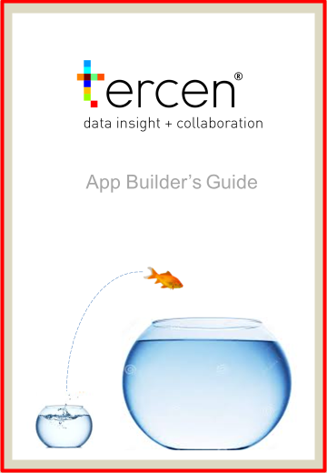

# Welcome {-}

<center>
```{r, echo=FALSE, out.width="50%"}

```
</center>

\

This guide outlines how to design, develop and share apps for __Tercen__.

* __Why read this guide?__ :
You are curious or wish to build an app for Tercen, then this is the guide.

* __Acknowledgement__:
I would like to thank all the users for their feedback. It has helped us improve Tercen.

* __Feedback__:
If you wish to give feedback then please do not hesitate to create an entry in the [issue tracker](https://github.com/tercen/appbuilders-guide/issues).

* __Motivation__:  
Tercen  promotes collaboration for data analysis. Not everyone can code or even 
wants to,  but everyone should benefit from the explosion of data and code 
currently taking place.
Tercen allows non programmers (e.g. biologists) to explore their data and 
allows programmers (e.g. bioinformaticians) to upload their code (or web-apps) 
for the biologist to use. By offering this services we believe biologist get 
empowered and can claim back control of their data. The bioinformatician gets 
liberated from the operational details and  day to day analysis demands from 
the biologist. This is summed up with the phrase:

> Tercen __empowers__ the biologist and __liberates__ the bioinformatician.

Discover all the incredible capabilities of our platform so that you can 
build useful and exciting apps directly on top of Tercen with ease - whether 
you're public apps, or you're building for your own team's private apps.

See what others have built on Tercen, chat with developers in our Community, 
and explore our documentation to get a sense of what you can do.

* Check out [Tercen Github](https://github.com/tercen) for some existing apps.
* Check out [Tercen Explore](https://tercen.com/explore) section to discover example projects.


<center></center>
