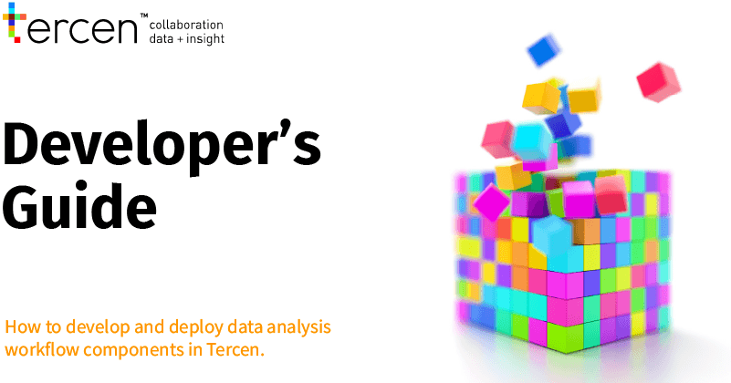

# Introduction {-}

<center>
```{r, echo=FALSE, out.width="100%"}

```
</center>

\

This guide outlines how to design, develop and share __modules__ for __Tercen__.

Tercen  promotes collaboration for data analysis. Not everyone can code or even 
wants to,  but everyone should benefit from the explosion of data and code 
currently taking place.

Tercen allows non programmers (e.g. biologists) to explore their data and 
programmers (e.g. bioinformaticians) to upload their code (or web-apps) 
for the biologist to use. By offering this services we believe biologist get 
empowered and can claim back control of their data. The bioinformatician gets 
liberated from the operational details and  day to day analysis demands from 
the biologist. This is summed up with the phrase:

> Tercen __empowers__ the biologist and __liberates__ the bioinformatician.

