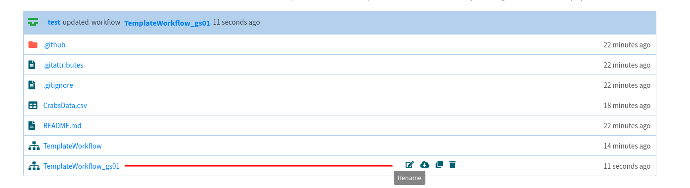

# (PART\*) Templates {.unnumbered}

# Building a template

## What is a template?

A __template__ is a reusable Tercen workflow. It is typically developed when you want to quickly reuse a data analysis workflow with a new dataset.

## General development workflow

The recommended __test-driven__ development workflow is as follows:
* Initialise a GitHub repository for your workflow based on a template provided by Tercen
* Clone this GitHub repository to your Tercen development instance
* Load a minimal dataset that will serve the purpose of unit testing. Be mindful that this dataset and everything that is computed by the workflow will be stored in your repository, hence they should remain small.
* Develop your workflow on your example dataset.
* Prepare the workflow template.
* Push your changes and deploy.

## Detailed workflow

__1. Create the Template Repo__

Create a new project based on the [template repository](https://github.com/tercen/template_workflow).

__2. Import the repository into Tercen__

Create a new project from Github.

__3. Create the Template Workflow__

Create a standard Tercen workflow. Run the steps as needed.

A finalized workflow might look like the one below.

__4. Clone and Rename__

Clone the workflow to create the **golden standard**. Rename it with an unique **_gs** suffix (see naming convention). 

__Naming Conventions__

* A Template workflow is compared to its Golden Standard workflows based on a naming convention. 

* A workflow is considered a Golden Standard if its name ends with **_gs***, where * is a set of letter and numbers. For example, Template_gs1, Template_gsA01 and Template_gsAA are all valid Golden Standard names, whereas Template_gs_01 is not.

* A Template and a Golden Standard are considered match if they have the same *base* name, that is, everything before the _gs suffix. For example, Workflow, Workflow_gs01 and Workflow_gs02 refer to a template (Workflow) and its two Golden Standards.

Once cloned, both Template and Golden Standard will be in the same folder. We want to move the Golden Standard workflow to a folder named **tests**. To do so, rename the Golden Standard, adding _tests/_ before the name and pressing the Ok button.

__5. Reset the Template Workflow__

Open the Template Workflow (the one without the _gs** suffix), reset and save it.

__6. Commit the Changes to Github__

Finally, select the Git button.

Then, add any desired commit message, your personal Github token and press Ok.

## Template installation

A template is installed like any Tercen module (operators, apps, templates).
You need to publish the template JSON only, the one at the root.

## How to add unit tests?

Coming soon.

# Updating a template

Coming soon.