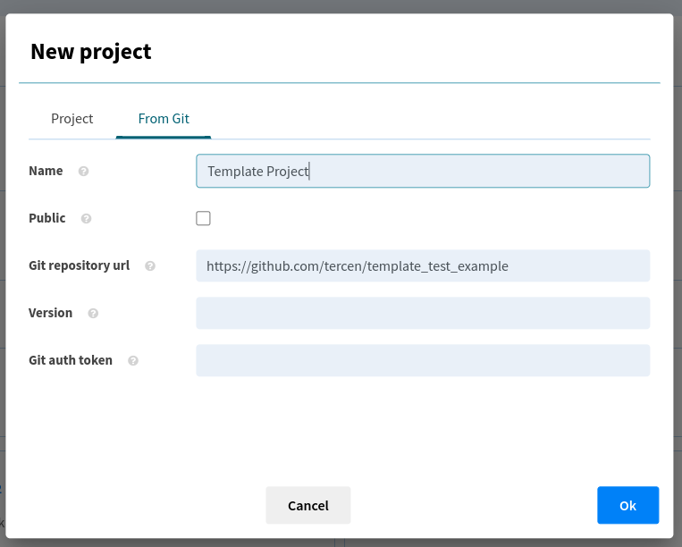
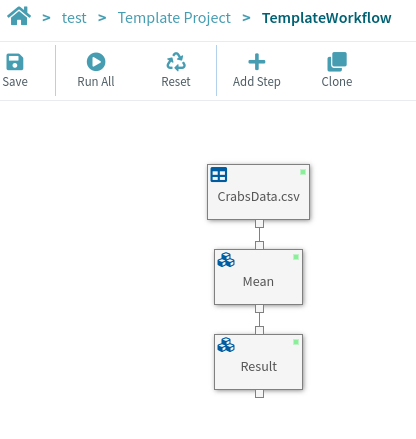
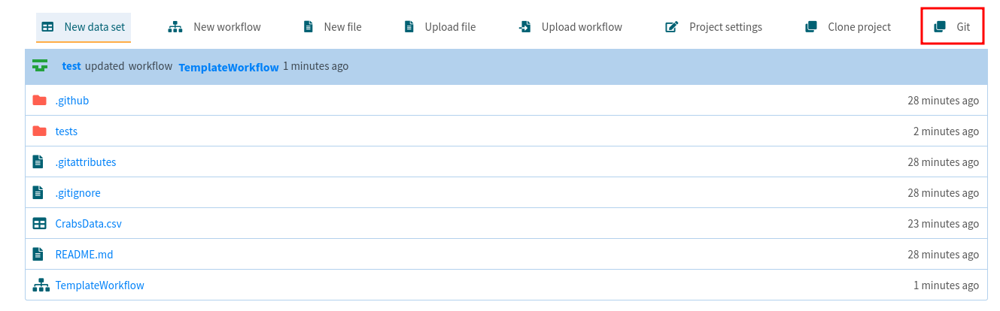

# (PART\*) Templates {.unnumbered}

# Building a template

## What is a template?

A __template__ is a reusable Tercen workflow. It is typically developed when you want to quickly reuse a data analysis workflow with a new dataset.

## General development workflow

The recommended __test-driven__ development workflow is as follows:

* Initialise a GitHub repository for your workflow based on a template provided by Tercen

* Clone this GitHub repository to your Tercen development instance

* Load a minimal dataset that will serve the purpose of unit testing. Be mindful that this dataset and everything that is computed by the workflow will be stored in your repository, hence they should remain small.

* Develop your workflow on your example dataset.

* Prepare the workflow template.

* Push your changes and deploy.

## Detailed workflow

__1. Create the Template Repo__

Create a new project based on the [template repository](https://github.com/tercen/template_workflow).

__2. Import the repository into Tercen__

Create a new project from Github.

</img>

</img>

__3. Create the Template Workflow__

Create a standard Tercen workflow. Run the steps as needed.

A finalized workflow might look like the one below.

</img>

__4. Clone and Rename__

Clone the workflow to create the **golden standard**. Rename it with an unique **_gs** suffix (see naming convention). 

</img>

</img>

__Naming Conventions__

* A Template workflow is compared to its Golden Standard workflows based on a naming convention. 

* A workflow is considered a Golden Standard if its name ends with **_gs***, where * is a set of letter and numbers. For example, Template_gs1, Template_gsA01 and Template_gsAA are all valid Golden Standard names, whereas Template_gs_01 is not.

* A Template and a Golden Standard are considered match if they have the same *base* name, that is, everything before the _gs suffix. For example, Workflow, Workflow_gs01 and Workflow_gs02 refer to a template (Workflow) and its two Golden Standards.

Once cloned, both Template and Golden Standard will be in the same folder. We want to move the Golden Standard workflow to a folder named **workflow_tests**. To do so, rename the Golden Standard, adding *workflow_tests/* before the name and pressing the Ok button.

</img>

__5. Reset the Template Workflow__

Open the Template Workflow (the one without the _gs** suffix), reset and save it.

__6. Select which elements to publish__

You should now have at least two workflows as part of your project: the __template__ and the __gold standard__. As we do not want the gold standard to be published in the library, you should make sure the "Publish" check box is unchecked for this workflow.

__7. Commit the Changes to Github__

Finally, select the Git button.

</img>

Then, add any desired commit message, your personal Github token and press Ok.

</img>

## Template installation

A template is installed like any Tercen module (operators, apps, templates). Check the [Operator Installation Chapter](https://tercen.github.io/developers_guide/installing-an-operator.html) to learn how to proceed.

# Continuous Integration Workflow

Here is a link to the [Workflow CI Action](https://github.com/tercen/actions/tree/main/workflow-CI) that is triggered after each push. This GitHub Action is a continuous integration (CI) workflow that automates the process of testing a workflow template using the tercen/workflow_runner_operator Docker container.

Here’s a breakdown of what each part of the workflow does:

### Inputs

The workflow accepts several inputs, which are parameters for the CI process:

* `git-repository` (required): The GitHub repository containing the template to be tested.
* `branch` (optional, defaults to main): The branch of the GitHub repository.
* `tag` (optional): A commit or version tag for the GitHub repository.
* `git-token` (required): GitHub access token used to authenticate and access the repository.
* `service-uri` (optional): The URI of a service to which the workflow will connect.
* `tercen-username` (optional): Tercen service username.
* `tercen-password` (optional): Tercen service password.

### Steps

__1. Start Tercen Services__

Action: tercen/actions/start-tercen@main
Starts necessary Tercen services to facilitate the test environment.

__2. Log in to Docker Registry__ 

Action: docker/login-action@v3.3.0
Logs into the GitHub Container Registry (ghcr.io) using the GitHub actor's credentials and the provided GitHub access token.

__3. Install Template Runner__

Run: Pulls the tercen/workflow_runner_operator:latest Docker image to run the workflow template tests.

__4. Test Template__

Run: Executes the tercen/workflow_runner_operator Docker container.
Uses the inputs for the GitHub repository, username/password for Tercen, the service URI, and the GitHub token to execute the test run.
The --report flag is used to generate a test report.

__5. Copy Result File__

Run: Copies the test results (a JSON file named test_results.json) from inside the Docker container (workflow_runner) to the local file system.

__6. Read Runner Results__

Run: Reads the test_results.json file and saves the contents into a GitHub output variable named JSON, removing spaces for easier processing.

__7. Check Runner Results__

Condition: If the Status field in the JSON output is not "Success," the workflow will fail with exit 1. This ensures that the test results are evaluated before proceeding.

__8. Upload Runner Results__

Action: actions/upload-artifact@v3
The test results (test_results.json) are uploaded as an artifact with a retention of 7 days, allowing the results to be stored and accessed later.

### Summary

CI testing is done by pulling a Docker container (tercen/workflow_runner_operator), running tests based on the specified GitHub repository, and evaluating the results. If the tests pass, the results are uploaded as artifacts for later inspection. If the tests fail, the workflow exits with an error.
